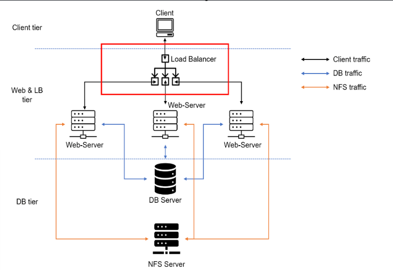

## Understanding Scalability and Load Balancing in Web Infrastructure

In the modern digital landscape, when a user accesses a website via a [URL](https://en.wikipedia.org/wiki/URL), they are typically unaware of the complex backend systems working behind the scenes to serve their requests. While accessing familiar websites such as [Google](https://www.google.com/?zx=1754085868080&no_sw_cr=1), [Reddit](https://www.reddit.com/), or [YouTube](http//www.youtube.com), it may appear as though a single server is handling the task. In reality, these platforms rely on vast networks of distributed servers to manage their massive daily traffic loads.

### How Domain Name Resolution Works

Every URL you enter contains a [domain name](https://en.wikipedia.org/wiki/Domain_name), such as `www.example.com`. Before your browser can fetch the web content, this domain name must be **translated into an IP address**—the unique identifier of a server that will handle the request. This translation is performed by [Domain Name System (DNS) servers](https://en.wikipedia.org/wiki/Domain_Name_System). A widely used DNS resolver is Google's, accessible via the public IP address `8.8.8.8`. You can query this DNS using tools like `nslookup` to manually resolve domain names.

### The Challenge of Growing Demand

Initially, a simple website may be hosted on a **single web server**. As the user base grows, so does the demand on system resources like **CPU** and **RAM**. There are two common strategies for handling increased traffic:

1. **Vertical Scaling** (Scaling Up): This involves upgrading the existing server by adding more CPU, RAM, or storage. While effective to a point, vertical scaling has physical and financial limitations. Eventually, the server reaches a maximum capacity, beyond which it cannot be upgraded.

2. **Horizontal Scaling** (Scaling Out): A more flexible and widely adopted solution is horizontal scaling, which involves adding multiple web servers and distributing the load among them. This approach is highly scalable, allowing systems to dynamically respond to increasing demand by adding or removing servers as needed.

### Scalability in Web Architecture

The ability of a system to manage increased load by adding resources is known as **scalability**. In horizontally scaled systems, scalability is typically implemented through **load balancing** mechanisms. This ensures that no single server is overwhelmed while others remain idle.

Above is the architecture server with a Load balancer on top of the Web servers.

### The Role of a Load Balancer

To manage horizontal scaling effectively, a **Load Balancer (LB)** is introduced into the architecture. A Load Balancer acts as a _single point of access_ with a public-facing IP address or domain name. It receives incoming traffic and intelligently distributes requests across the available web servers based on specific algorithms or current server loads. This not only improves _performance_ and _reliability_, but also _abstracts_ the backend complexity from the user. The user simply accesses the website via a single `URL`, without needing to know how many servers are serving the request behind the scenes.

There are two primary types of Load Balancers:

* **Layer 4 (L4) Network Load Balancer** – Operates at the transport layer (TCP/UDP), distributing traffic based on IP and port.
* **Layer 7 (L7) Application Load Balancer** – Operates at the application layer (HTTP/HTTPS), capable of routing based on URL paths, headers, etc.

Common software-based L7 load balancers include:

* **Apache HTTP Server**
* **NGINX**
* **HAProxy**

**We will Explore the differences between Layer 4 and Layer 7 load balancers and when to use each.**

## Layer 4 vs Layer 7 Load Balancers

Load balancers operate at different layers of the [OSI model](https://en.wikipedia.org/wiki/OSI_model), primarily Layer 4 (Transport Layer) and Layer 7 (Application Layer). Understanding their differences is essential for designing scalable and responsive systems.

---

###  Layer 4 Load Balancer (Transport Layer)

#### How it works:

* Operates at the TCP/UDP level.
* Routes traffic **based on IP address and port number**.
* Does **not inspect** the actual content of network packets (e.g., HTTP headers or URLs).

#### Pros:

* **Fast and efficient**: Minimal overhead since it forwards packets without examining the payload.
* **Protocol-agnostic**: Works with any protocol (HTTP, HTTPS, FTP, SMTP, etc.).
* Suitable for **raw TCP/UDP services** like databases, messaging queues, or media streaming.

#### Limitations:

* **No application-layer logic**: Cannot make routing decisions based on URLs, cookies, or headers.
* **Basic health checks**: Limited to TCP handshake or port availability.

#### When to Use:

* For **simple, low-latency applications** (e.g., load balancing MySQL, Redis, or SSH traffic).
* Where you want **high performance** with minimal processing overhead.
* When traffic is **non-HTTP** or **encrypted end-to-end** (L4 LB won’t decrypt SSL traffic).

---

### **Layer 7 Load Balancer (Application Layer)**

####  How it works:

* Operates at the HTTP/HTTPS layer.
* Makes routing decisions based on **application data**, such as:

  * URL paths (`/login`, `/api`)
  * Hostnames (multi-domain hosting)
  * Cookies, headers, query strings

#### Pros:

* **Advanced routing**: Can direct traffic to different servers or microservices based on content.
* **SSL termination**: Can decrypt SSL traffic for inspection and routing.
* Supports **content-based caching**, **compression**, and **application firewalling**.
* Fine-grained control over application traffic flow.

#### Limitations:

* Slightly **more processing overhead** than L4 due to deep packet inspection.
* Primarily supports **HTTP/S traffic**.

#### When to Use:

* When you're building **microservices** or **multi-tenant applications**.
* When routing needs to be based on **path, headers, or host**.
* For **API gateways**, **web applications**, and **reverse proxy scenarios**.
* When you need features like **SSL offloading**, **authentication**, or **URL-based routing**.

---

##  Summary Comparison Table

| Feature                    | Layer 4 Load Balancer    | Layer 7 Load Balancer         |
| -------------------------- | ------------------------ | ----------------------------- |
| OSI Layer                  | Layer 4 (Transport)      | Layer 7 (Application)         |
| Protocol Awareness         | TCP/UDP                  | HTTP/HTTPS                    |
| Routing Basis              | IP & Port                | URL, headers, cookies, host   |
| SSL Offloading             | ❌                        | ✅                             |
| Performance                | ⚡ Very Fast              | ⚡ Fast (slightly slower)      |
| Use with Non-HTTP Services | ✅                        | ❌                             |
| Content-Based Routing      | ❌                        | ✅                             |
| Use Case Examples          | Database, FTP, SMTP, DNS | Web apps, REST APIs, websites |

---

##  Common Real-World Examples

| Scenario                                         | Use    |
| ------------------------------------------------ | ------ |
| Load balancing web traffic between APIs          | **L7** |
| Distributing MySQL or Redis traffic              | **L4** |
| Handling HTTPS websites with multiple subdomains | **L7** |
| Balancing raw TCP traffic for VPN connections    | **L4** |

---

## Conclusion

* Use **Layer 4 Load Balancers** for **performance-sensitive, protocol-agnostic traffic**, such as database clusters or game servers.
* Use **Layer 7 Load Balancers** when your application requires **intelligent routing** based on HTTP/HTTPS content, such as in modern web applications, microservices, and APIs.

In this project, we are tasked with deploying a web application for a **construction company**. The application will be hosted across **two Ubuntu-based EC2 web servers**. To ensure scalability and efficient traffic distribution, we will introduce an **Apache-based Load Balancer** on a separate EC2 instance.

### Objectives

* Deploy and configure an **Apache Load Balancer** on an Ubuntu EC2 instance.
* Route incoming HTTP traffic to the two backend web servers.
* Ensure users access the web application through a **single public-facing URL**, while their requests are efficiently distributed across the backend servers.

Although this implementation will use two servers, the architecture can be easily scaled to include three or more web servers, following the same pattern. 
We will take this step by step in the next chapter.
