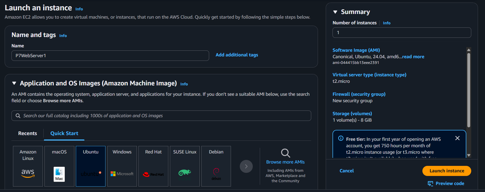
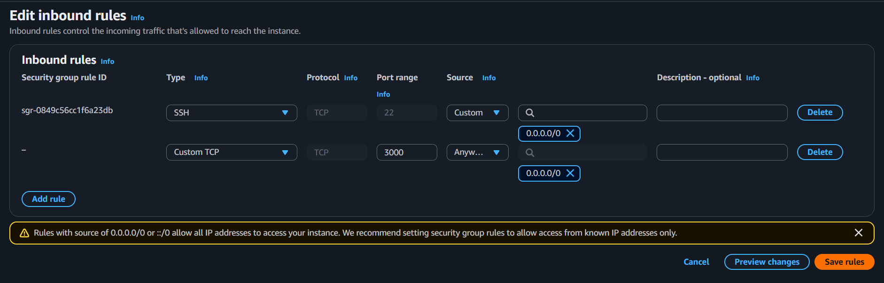
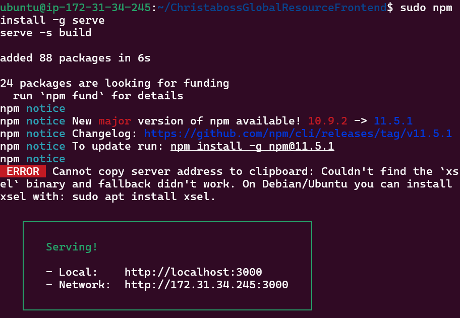
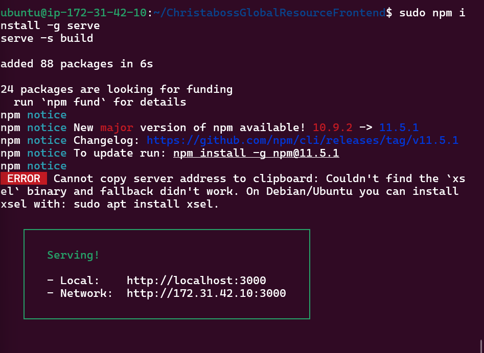
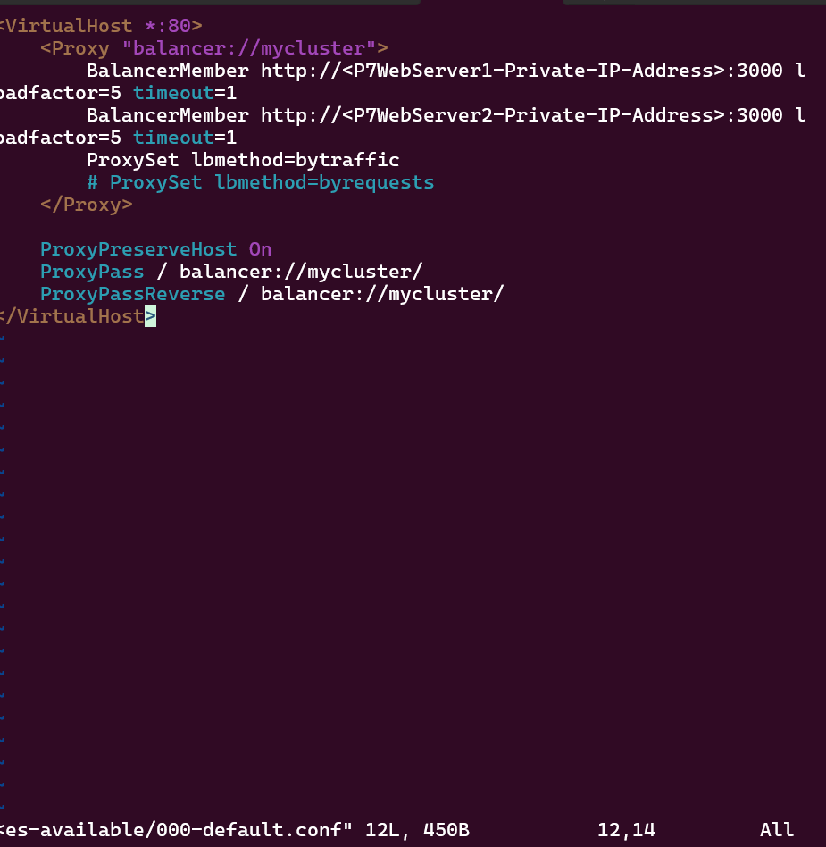
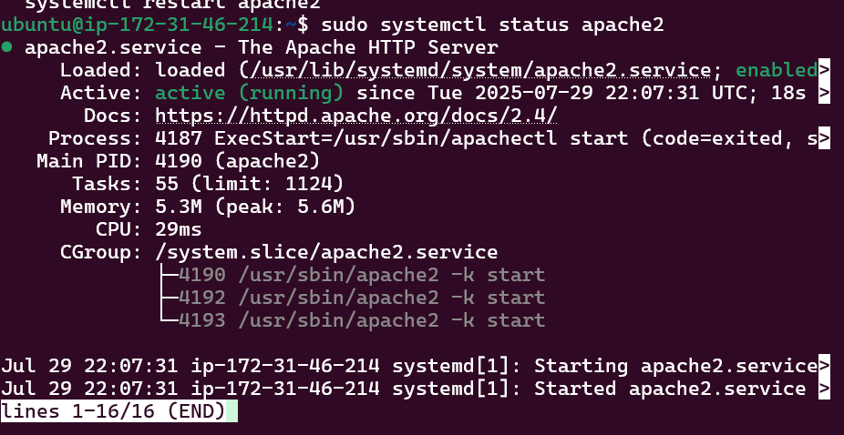

## Implementation Guide: Deploying an Apache Load Balancer on AWS

This section outlines the practical steps involved in deploying a **load-balanced web application** architecture using **Apache HTTP Server** as a **Layer 7 (L7) Load Balancer**. The setup consists of two backend EC2 web servers serving a Node.js frontend, and a third EC2 instance functioning as the Load Balancer.

---

### **Architecture Overview**

**Components:**

* `P7WebServer1`: Ubuntu EC2 instance hosting the frontend on port 3000
* `P7WebServer2`: Identical setup to P7WebServer1
* `Project-7-Apache-LB`: Ubuntu EC2 instance with Apache Load Balancer, forwarding HTTP traffic to backend servers

**Traffic Flow:**

1. User accesses the website using the Load Balancer's **public IP or DNS name**.
2. Apache receives the HTTP request and forwards it to one of the web servers.
3. The web server processes the request and sends the response back through the load balancer.

---

### **Step 1: Launch EC2 Instances**

* **Create 3 Ubuntu 20.04/22.04 EC2 instances**:

  * Two for web servers (P7WebServer1 & P7WebServer2)
  * One for the load balancer (Project-7-Apache-LB)

* Assign them to the same **VPC** and ensure they are in subnets that allow internal communication.




* **Security Group Configuration**:

  * Web Servers: Allow inbound on port **22 (SSH)** and **3000 (web traffic)**
  * Load Balancer: Allow inbound on port **22** and **80 (HTTP)**

  


---

### Step 2: Deploy and Serve Frontend on Web Servers

On both P7WebServer1 and P7WebServer2 as you have ssh the server in your linux local machine:

```
sudo apt update -y && sudo apt upgrade -y && sudo apt install git npm curl -y
```

```
curl -fsSL https://deb.nodesource.com/setup_22.x | sudo -E bash -
sudo apt install -y nodejs
```
**We clone from Git,** as the code is in a Git repository, clone it to the EC2 instances:

```
git clone https://github.com/theGameChangerDev/ChristabossGlobalResourceFrontend
cd ChristabossGlobalResourceFrontend
```

**Install Dependencies** and build the application, then the folder is ready to be deployed and we serve with static server

```
npm install
npm run build
sudo npm install -g serve
serve -s build -l 3000
```

 For server1

 For server2

We can also access it by visiting http://<public-ip>:3000

Keep this terminal running or use a **process manager** like `pm2` to serve in the background.

Now to the next step

---

### **Step 3: Configure Apache Load Balancer**

**On Project-7-Apache-LB:**

```
sudo apt update
sudo apt install apache2 -y
sudo apt-get install libxml2-dev -y

# Enable load balancing modules
sudo a2enmod rewrite proxy proxy_balancer proxy_http headers lbmethod_bytraffic
sudo systemctl restart apache2
```
To check the status and confirm the apache is running:

```
sudo systemctl status apache2
``` 


### Step 4: Configure the Virtual Host for Load Balancing

1. Backup and edit the default config file:

```
sudo cp /etc/apache2/sites-available/000-default.conf /etc/apache2/sites-available/000-default.conf.bakkup.conf
```

```
sudo vi /etc/apache2/sites-available/000-default.conf
```

2. Delete existing lines (`:%d` in `vi`) and paste the following:

```apache
<VirtualHost *:80>
    <Proxy "balancer://mycluster">
        BalancerMember http://<P7WebServer1-Private-IP>:3000 loadfactor=5 timeout=1
        BalancerMember http://<P7WebServer2-Private-IP>:3000 loadfactor=5 timeout=1
        ProxySet lbmethod=bytraffic
    </Proxy>

    ProxyPreserveHost On
    ProxyPass / balancer://mycluster/
    ProxyPassReverse / balancer://mycluster/
</VirtualHost>
```




3. Replace `<P7WebServer1-Private-IP>` and `<P7WebServer2-Private-IP>` with the **actual private IP addresses** of your web servers (found in the EC2 console).

4. Restart Apache:

```
sudo systemctl restart apache2
```

 Our apache up and running

### Step 5: Test the Setup

* Visit: `http://<Apache-LB-Public-IP>`

```
http://<Load-Balancer-Public-IP-Address-or-Public-DNS-Name>:80
``` 

* We see the frontend application load correctly.
* Refresh the page multiple times to test if both web servers are being used (check logs on both web servers with `tail -f`)


This is the site we see when everything is done correctly. 

Each refresh triggers a new HTTP GET request. Monitor the log files on both backend web servers to confirm that these requests are being distributed between them. You should observe new entries appearing in the log files of each server, indicating that traffic is being successfully routed through the Load Balancer.

Since both backend servers have been assigned an equal load factor, traffic should be evenly balanced across them. This means that the number of requests received by each server will be approximately the same, ensuring fair distribution of incoming traffic.

If the setup is correct, the load balancing process will be seamless to end users. They will experience uninterrupted access to the website without being aware that multiple servers are serving their requests in the background.

**Two-image**


#### Configuring Local Domain Name Resolution on the Load Balancer

Managing multiple servers using their IP addresses can become cumbersome, especially in environments with a growing number of backend systems. To simplify server identification and improve manageability, local domain name resolution can be implemented. While not scalable for large environments, editing the `/etc/hosts` file is a quick and effective method suitable for small-scale setups or demonstration purposes.

#### **Step-by-Step Implementation**

1. **Edit the Hosts File**
   On your Load Balancer (LB) server, open the `/etc/hosts` file using a text editor:

   ```bash
   sudo vi /etc/hosts
   ```

2. **Add Hostname Entries**
   Insert the private IP addresses of your two web servers, assigning them simple, recognizable names (e.g., `Web1` and `Web2`). Example:

   ```
   <WebServer1-Private-IP-Address> Web1
   <WebServer2-Private-IP-Address> Web2
   ```

3. **Update Load Balancer Configuration**
   Once the names are mapped in the `hosts` file, you can update the Apache Load Balancer configuration to reference the servers by name instead of by IP address:

   ```apache
   BalancerMember http://Web1:3000 loadfactor=5 timeout=1
   BalancerMember http://Web2:3000 loadfactor=5 timeout=1
   ```

4. **Test the Name Resolution**
   From the LB server, test connectivity using the following commands:

   ```bash
   curl http://Web1
   curl http://Web2
   ```

   These commands should return responses from each web server, confirming that local name resolution is functioning properly.

#### Important Note

This configuration is local to the Load Balancer server only. The custom hostnames (e.g., `Web1`, `Web2`) will not be resolvable from other servers or from the Internet. For broader, scalable name resolution across your infrastructure, you should consider using a DNS service like **Amazon Route 53** or setting up an internal DNS server.


